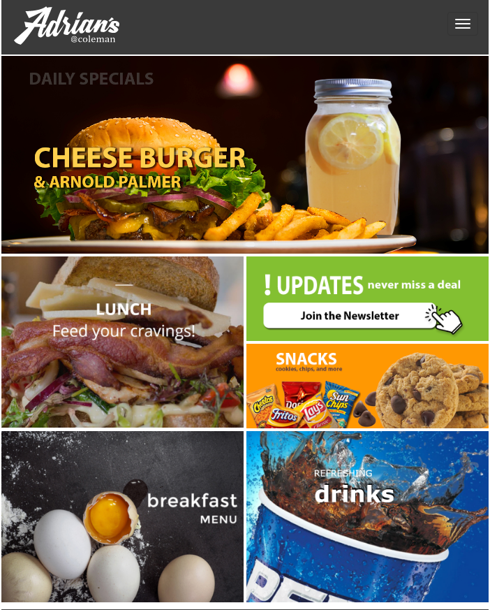
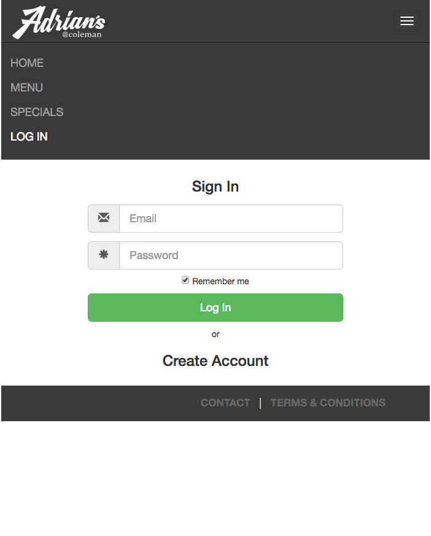
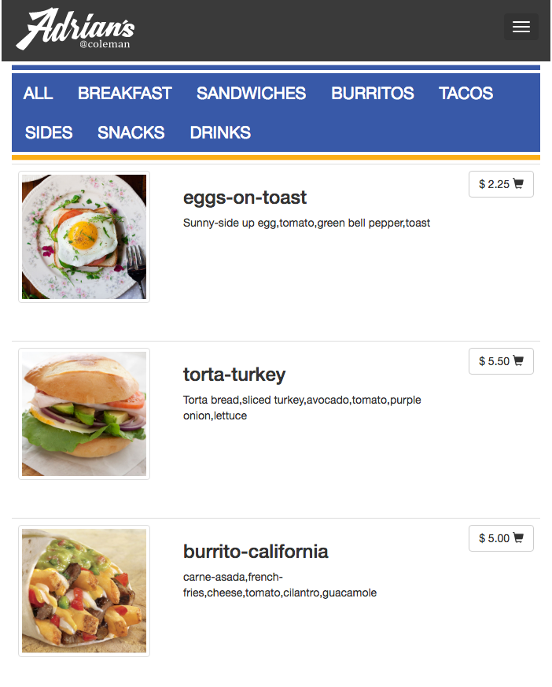
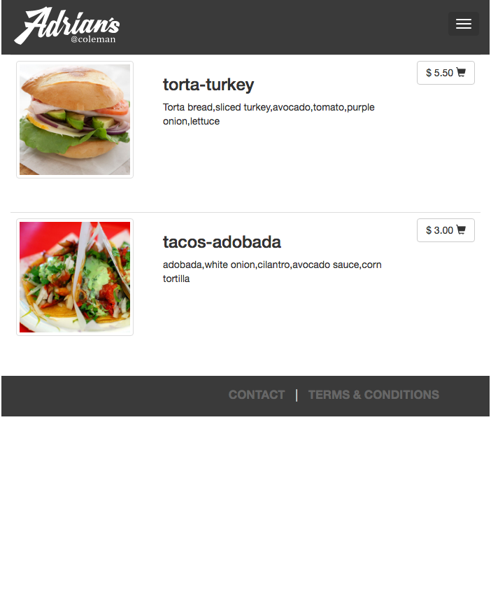
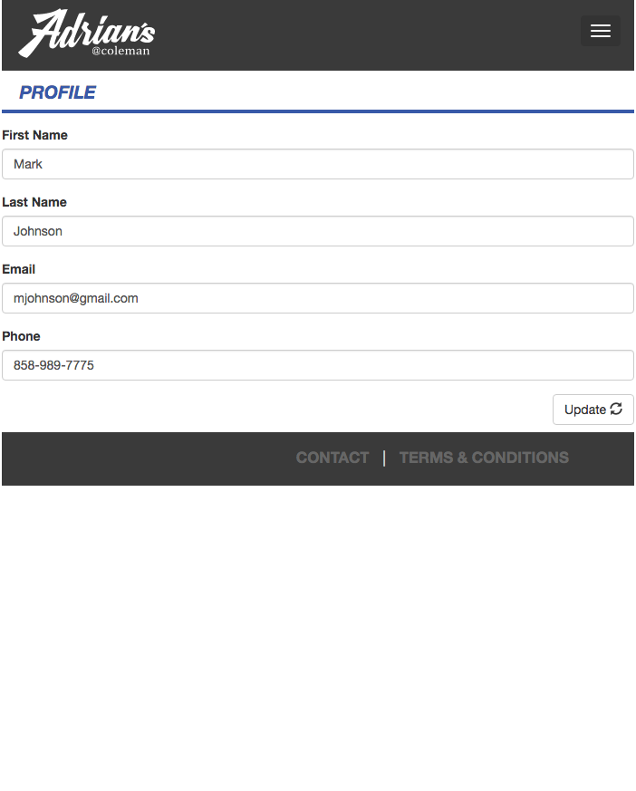
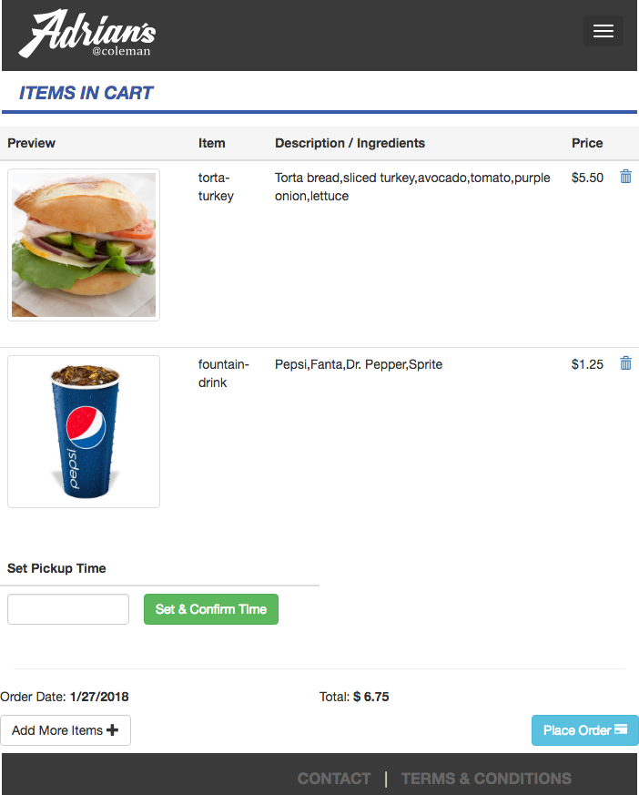
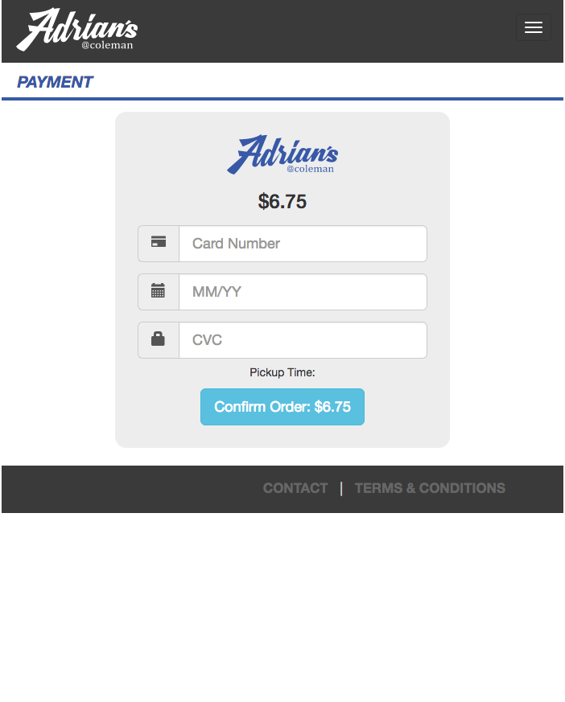
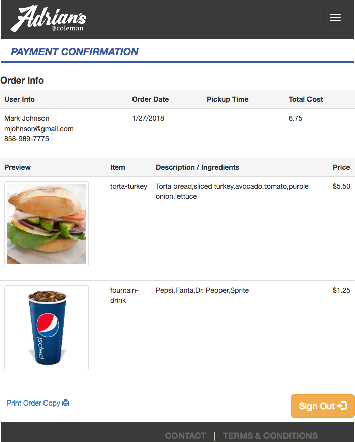

# Adrian's Cafe
### Prototype SPA using ES6, ESLint, Babel, and Gulp

### This project uses npm (node) and gulp to transpile
- Node JS
- Gulp

## Get it up and Running
- Read: Environment_Setup.txt -- You will not need to do everything in this file.
- Once Node and Gulp are installed: in your Terminal (aka. Command line): Type >
```
npm install
gulp
```
- The ES6 should transpile to the dist folder.
- Open the dist folder and click on the index.html file

### Screenshots








